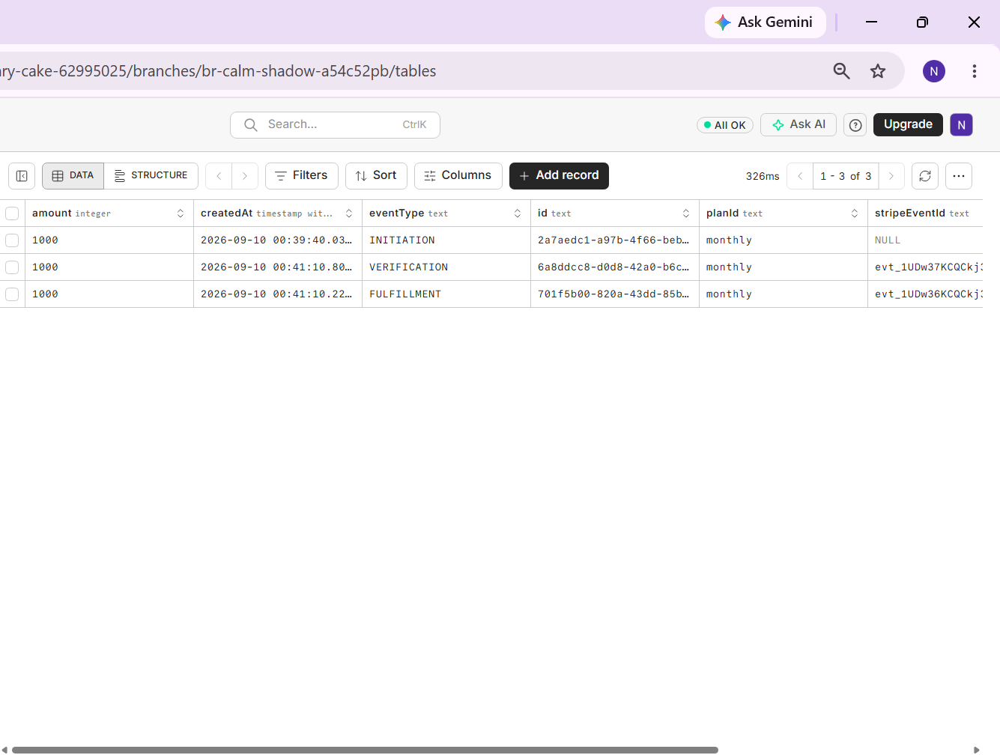
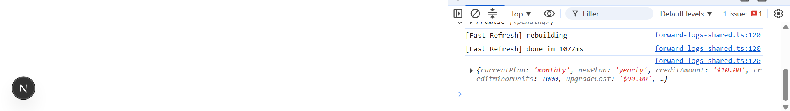
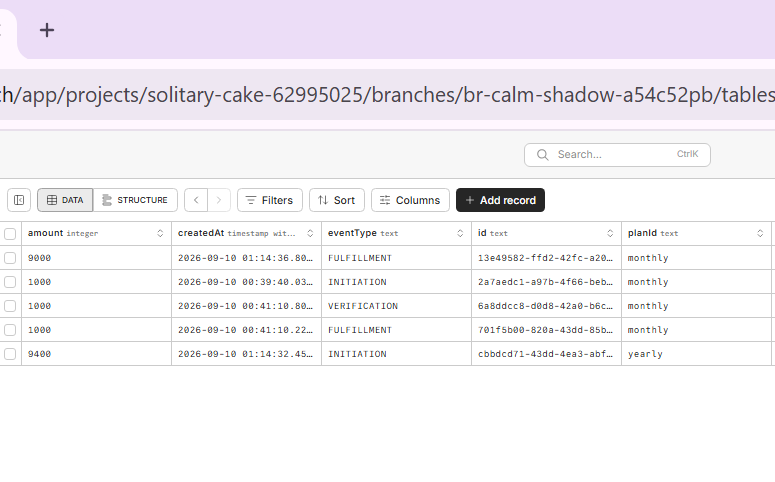
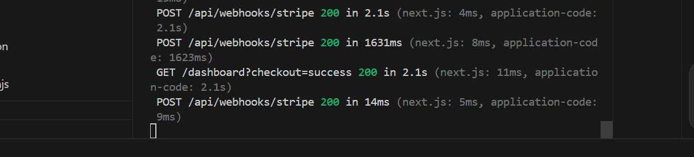
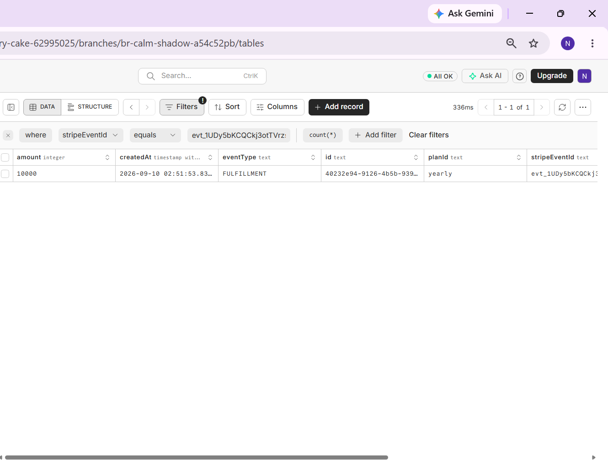
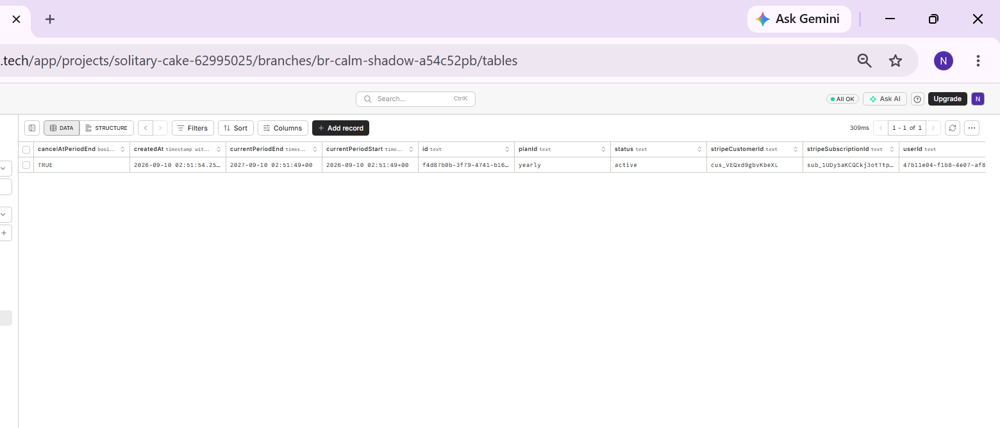
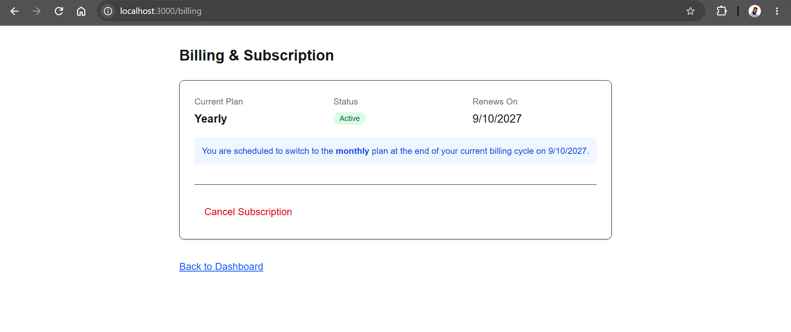
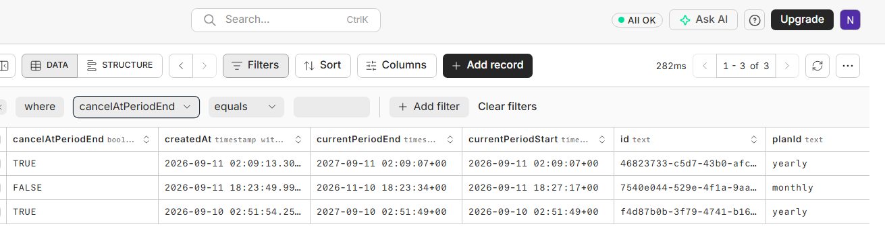
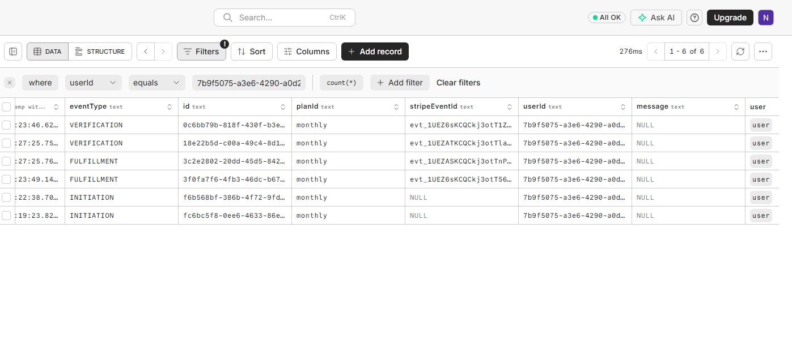

# Payments Slice — Documentation

## 1. What This Is

This is a complete subscription and payment slice built on top of the authentication system from a previous assessment: a signed-in user can view plans, subscribe to a monthly or yearly plan through Stripe in test mode, upgrade with a real prorated credit calculated and shown before the charge, downgrade with the change taking effect at the end of the current billing period, and cancel while retaining access through the period already paid for. Every payment event — initiation, verification, fulfillment, and failure — is recorded as its own row in an append-only log, and entitlement is only ever granted after server-side webhook verification, never on the strength of a client redirect.

What's deliberately not here: no product features behind the paywall, since the thing being sold is a plan flag on a user record and nothing more. No pricing marketing page — the plans view is a bare functional list with a button per plan, not a persuasive sales page. No profile editing, settings, or dashboard features beyond what already existed from the reused authentication slice. Authentication itself (signup, signin, email verification, password reset) is reused directly from that earlier assessment, stated here rather than hidden, since the brief explicitly permits this and the focus of this slice is the payment logic built on top of it.

## 2. How To Run It

**Prerequisites**

- Node.js (v20+ recommended)
- PostgreSQL running locally or remotely (e.g. Neon, Supabase)
- Stripe CLI installed and authenticated (for local webhook testing)

**Steps**

1. Clone the repository and install dependencies with `npm install`.
2. Copy `.env.example` to `.env` and fill in the required values.
3. Push the Prisma schema to your database using `npx prisma db push`.
4. Open a second terminal and start the Stripe CLI listener to forward webhooks to your local server.
5. Copy the webhook signing secret from the Stripe CLI output and paste it into `.env` as `STRIPE_WEBHOOK_SECRET`.
6. Start the development server using `npm run dev`.

**Environment variables**

| Name | Where it comes from |
|---|---|
| `DATABASE_URL` | Your PostgreSQL instance's connection string (e.g., Neon). |
| `STRIPE_SECRET_KEY` | Your Stripe Dashboard (Test Mode) -> Developers -> API keys. |
| `NEXT_PUBLIC_STRIPE_PUBLISHABLE_KEY` | Your Stripe Dashboard (Test Mode) -> Developers -> API keys. |
| `STRIPE_PRICE_MONTHLY` | Your Stripe Dashboard -> Product Catalog -> Monthly Plan -> Price ID. |
| `STRIPE_PRICE_YEARLY` | Your Stripe Dashboard -> Product Catalog -> Yearly Plan -> Price ID. |
| `STRIPE_WEBHOOK_SECRET` | Provided by the Stripe CLI when you run `stripe listen`. |
| `EMAIL_API_KEY` | Your email provider dashboard (reused from auth-slice, though email is currently mocked to the console). |

**Database setup**

```bash
npx prisma db push
```

**Start it**

Terminal 1 (Webhooks):
```bash
stripe listen --forward-to localhost:3000/api/webhooks/stripe
```

Terminal 2 (App):
```bash
npm run dev
```

**It appears at:** `http://localhost:3000`

## 3. The Flow, Step By Step

### Step 1 — Sign Up and Sign In (Reused from auth-slice)

**User:** Enters their email and a password on the `/signup` page, verifies their email using a 6-digit code, and is automatically signed in. (Alternatively, uses `/signin` if they already have an account).
**Frontend sends:** A `POST` to `/api/auth/signup` containing the email and password, then a `POST` to `/api/auth/verify` with the code.
**Server does:** Hashes the password, creates the user, generates and mocks sending the email verification code to the console, and upon successful verification, creates a session, sets the `sessionId` HTTP-only cookie, and redirects to the dashboard.
**Lives in:** `app/api/auth/signup/route.ts`, `app/api/auth/verify/route.ts`, `app/api/auth/signin/route.ts`

### Step 2 — Viewing Plans

**User:** Navigates to `/plans` to view the available subscription tiers (Monthly and Yearly).
**Frontend sends:** A standard `GET` request to load the page.
**Server does:** Renders the static plans view, offering subscribe buttons for each.
**Lives in:** `app/plans/page.tsx`

### Step 3 — Initiating Checkout

**User:** Clicks the "Subscribe" button for their chosen plan.
**Frontend sends:** A `POST` request to `/api/checkout` containing the `planId` (e.g., `monthly` or `yearly`).
**Server does:** Verifies the user is authenticated and doesn't already have an active subscription. Applies rate limiting. Creates a Stripe Checkout Session via the Stripe SDK, logs an `INITIATION` row in `PaymentEvent`, and returns the Stripe checkout URL. The client then redirects the user to that URL.
**Lives in:** `app/api/checkout/route.ts`

### Step 4 — Completing Payment and Returning

**User:** Enters their test card details on the Stripe-hosted checkout page and clicks pay. Stripe redirects them back to `/return`.
**Frontend sends:** A `GET` request to `/return`, triggering the client-side `AutoRefresh` component which polls the server.
**Server does:** The `/return` page reads the user's active `Subscription` status from the database. If it's not active yet, it displays a "Processing" state. Once the webhook confirms the payment (see Step 5) and the database is updated, the page refreshes to show a "Success" state.
**Lives in:** `app/return/page.tsx`, `app/return/AutoRefresh.tsx`

### Step 5 — Webhook Fulfillment (Server-to-Server)

**User:** Does nothing directly. This happens purely in the background between Stripe and our server.
**Frontend sends:** N/A. Stripe sends a `POST` request to `/api/webhooks/stripe`.
**Server does:** Validates the webhook signature using `STRIPE_WEBHOOK_SECRET`. For `checkout.session.completed`, it logs a `VERIFICATION` event. For `invoice.paid`, it logs a `FULFILLMENT` event, checks for idempotency, maps the Stripe customer and subscription IDs to the local user, and updates or creates the `Subscription` row to grant entitlement.
**Lives in:** `app/api/webhooks/stripe/route.ts`, `lib/payments/stripe.ts`

### Step 6 — Viewing and Managing Billing

**User:** Navigates to `/billing` to view their active subscription status, renewal date, and management options.
**Frontend sends:** A `GET` request for the page.
**Server does:** Fetches the user's `Subscription` row and renders the current state (plan, status, renewal/end date). If active, it renders the `BillingControls` component offering Upgrade, Downgrade, or Cancel buttons depending on the current plan.
**Lives in:** `app/billing/page.tsx`, `app/billing/BillingControls.tsx`

### Step 7 — Upgrading (Monthly to Yearly)

**User:** Clicks "Upgrade to Yearly" and confirms the prorated credit preview shown in the modal (if added) or just triggers the upgrade.
**Frontend sends:** A `POST` to `/api/subscription/upgrade/confirm`.
**Server does:** Calculates the prorated credit internally (for display/logging purposes), then updates the Stripe subscription via the SDK to the yearly price with `proration_behavior: 'always_invoice'`. Stripe instantly issues and pays a prorated invoice, triggering a new `invoice.paid` webhook that logs a new `FULFILLMENT` event and extends the local `currentPeriodEnd`.
**Lives in:** `app/api/subscription/upgrade/confirm/route.ts`, `lib/payments/money.ts`

### Step 8 — Downgrading (Yearly to Monthly)

**User:** Clicks "Downgrade to Monthly".
**Frontend sends:** A `POST` to `/api/subscription/downgrade`.
**Server does:** Calls the Stripe API to schedule a subscription schedule (or update) so the downgrade takes effect at the end of the current billing cycle rather than immediately. It updates the local `Subscription` row by setting `pendingPlanId = 'monthly'`.
**Lives in:** `app/api/subscription/downgrade/route.ts`

### Step 9 — Canceling

**User:** Clicks "Cancel Subscription", optionally provides a reason, and confirms.
**Frontend sends:** A `POST` to `/api/subscription/cancel` containing the optional reason.
**Server does:** Calls Stripe to update the subscription with `cancel_at_period_end: true`. It updates the local `Subscription` row by setting `cancelAtPeriodEnd = true`, leaving `status = 'active'`, allowing the user to retain access until the period ends. It also logs a `CANCELLATION` event to record the cancellation reason.
**Lives in:** `app/api/subscription/cancel/route.ts`


## 4. The Data Model

### `User`
Holds the core identity and credentials for a registered user.

| Column | Type | Constraint | Decision |
|---|---|---|---|
| `id` | `String` | `@id @default(uuid())` | Using a UUID prevents predictable sequence iteration (Insecure Direct Object Reference) when referencing users in API routes or foreign keys. |
| `email` | `String` | `@unique` | Enforces that each email maps to exactly one account at the database level, preventing race conditions from creating duplicate accounts. |

### `Session`
Stores active login sessions to allow persistent authentication and controlled revocation.

| Column | Type | Constraint | Decision |
|---|---|---|---|
| `userId` | `String` | Foreign Key (`@relation onDelete: Cascade`) | Ensures a session cannot exist without a valid user, and instantly invalidates all active sessions if the user account is deleted. |
| `expiresAt` | `TimestamptzString` | | Explicitly tracks when the session becomes invalid, allowing for automatic expiration without requiring a background cleanup job to run constantly. |

### `VerificationCode`
Holds temporary 6-digit codes used to verify email ownership during signup.

| Column | Type | Constraint | Decision |
|---|---|---|---|
| `userId` | `String` | Foreign Key (`@relation onDelete: Cascade`) | Ties the verification flow strictly to an existing user record. |
| `code` | `String` | | Stored in plain text since it is a short-lived, randomly generated OTP rather than a persistent secret. |
| `expiresAt` | `TimestamptzString` | | Ensures the code cannot be used indefinitely if intercepted later. |
| `lastSentAt` | `TimestamptzString` | | Used to enforce a cooldown period between resend attempts to prevent email spam abuse. |

### `PasswordResetToken`
Stores secure, single-use tokens for the forgot-password flow.

| Column | Type | Constraint | Decision |
|---|---|---|---|
| `userId` | `String` | Foreign Key (`@relation onDelete: Cascade`) | Ties the reset capability strictly to an existing user record. |
| `tokenHash` | `String` | `@unique` | The raw token is emailed to the user, but only a hashed version is stored. This prevents an attacker who dumps the database from hijacking active reset flows. The unique constraint prevents token collision. |
| `expiresAt` | `TimestamptzString` | | Enforces a strict time window on the token's validity, typically 15-30 minutes, minimizing the risk of a stale link being exploited. |

### `RateLimit`
Tracks API endpoint usage to prevent brute-force attacks and abuse.

| Column | Type | Constraint | Decision |
|---|---|---|---|
| `key` | `String` | `@id` | A composite key (e.g., `checkout_127.0.0.1`) that uniquely identifies the action and the actor. |
| `points` | `Int` | `@default(1)` | Counts the number of attempts within the current window. |
| `expiresAt` | `TimestamptzString` | | Automatically resets the window when crossed; acts as the cleanup threshold. |

### `Subscription`
Tracks the current state of a user's entitlement and billing cycle.

| Column | Type | Constraint | Decision |
|---|---|---|---|
| `userId` | `String` | `@unique` / Foreign Key | The `@unique` constraint enforces a strict 1:1 relationship—a user can only have one active subscription state at a time, preventing overlapping or duplicate billing states. |
| `planId` | `String` | | The actual entitlement granted to the user (e.g., `monthly`, `yearly`). |
| `pendingPlanId` | `String?` | Nullable | Stores an intended downgrade plan to switch to at period end. Nullable because it is only populated when a downgrade is actively scheduled. |
| `cancelAtPeriodEnd` | `Boolean` | `@default(false)` | Decouples the decision to cancel from the immediate loss of access, allowing the user to ride out their paid time. |
| `stripeSubscriptionId` | `String` | `@unique` | Maps the local state to the definitive Stripe object. Crucial for matching incoming webhooks to the correct row. |

### `PaymentEvent`
An immutable, append-only log of every stage of every payment attempt.

| Column | Type | Constraint | Decision |
|---|---|---|---|
| `stripeEventId` | `String?` | `@unique` | The core idempotency lock. Enforcing uniqueness at the DB level guarantees that even if Stripe sends the same webhook twice simultaneously, the second insert will be rejected, preventing duplicate fulfillment. |
| `eventType` | `String` | | Separates the lifecycle into distinct, independent phases (`INITIATION`, `VERIFICATION`, `FULFILLMENT`, `FAILURE`). |
| `amount` | `Int` | | Stored as an integer (minor units/cents) to avoid floating-point precision errors that plague decimal math. |
| `message` | `String?` | Nullable | Stores optional context like failure reasons or cancellation feedback without polluting the active `Subscription` state. |

### Which constraints make an invalid state impossible?

The `@unique` constraint on `User.email` makes it impossible for two accounts to share an email, closing the exact race condition where two signup requests arriving nearly simultaneously could otherwise both succeed before either has finished checking whether the email exists.

The `@relation(onDelete: Cascade)` foreign keys on `Session`, `VerificationCode`, and `PasswordResetToken` make it impossible for any of these to exist without pointing at a real user, and guarantee that deleting a user cleanly removes their associated auth records rather than leaving orphaned rows behind.

The `@unique` constraint on `Subscription.userId` makes it impossible for a single user to ever have two subscription rows simultaneously, which is what makes the checkout-block logic reliable — the code can trust that "does this user have a subscription" is always a single, unambiguous answer, never a choice between multiple conflicting rows.

The `@unique` constraint on `Subscription.stripeSubscriptionId` makes it impossible for two local subscription rows to ever both claim to represent the same Stripe subscription, which matters directly for webhook processing — an incoming event can be matched to exactly one local row with certainty.

The `@unique` constraint on `PaymentEvent.stripeEventId` is the constraint the whole idempotency design depends on: it makes it impossible for the same Stripe event to ever be recorded twice, regardless of how many times Stripe delivers it, no matter what the application code does or fails to check beforehand.

The `PasswordResetToken.tokenHash` unique constraint makes it impossible for two different reset tokens to ever collide on the same hash value, which matters because a collision would let one user's reset link accidentally validate against a different user's pending request.

## 5. The Concepts

### Proration

**What it is.**
Proration is the calculation of a fair partial charge when a subscription changes plans mid-cycle. If someone upgrades from a $10/month plan to a $100/year plan partway through their monthly period, they shouldn't pay the full yearly price on top of the money they've already paid for time they haven't used — proration figures out how much of their unused time is worth, and credits that amount against the new plan's cost.

**Why it is needed.**
Without it, either the customer is charged the full new price on top of what they already paid for days they haven't used yet — effectively overcharging them for the same period twice — or the business just eats the unused time as a loss on every single upgrade. Neither is sustainable at any real scale, and a customer who feels overcharged during an upgrade is exactly the kind of thing that generates support tickets and lost trust.

**How I implemented it.**
In lib/payments/money.ts, calculateProratedCredit takes the days remaining in the current period, the total days in the period, and the price of the plan being left, and computes (daysRemaining / totalDays) × price, rounding the result up in the customer's favor with Math.ceil. I verified this with a real test: 12 days into a 30-day monthly cycle, 18 days remaining, credit = (18/30) × $10.00 = $6.00, upgrade cost = $100.00 − $6.00 = $94.00. Both numbers matched the endpoint's actual output exactly. The calculated number is shown to the user as a preview before the charge, and the actual charge is executed by Stripe's own proration engine (proration_behavior: 'always_invoice'), which may differ from my estimate by at most a few cents due to Stripe calculating to the exact second rather than the day.

**What I chose against, and why.**
I considered making my own calculation the literal source of the charge, using proration_behavior: 'none' and manually creating an invoice item for my exact number. I chose against this because it would mean replacing Stripe's well-tested billing engine with a fragile multi-step sequence — update the subscription, create an invoice item, create and pay an invoice — where a failure partway through leaves the subscription and the charge out of sync, for a discrepancy of at most a few cents that provides no real benefit to the customer. Showing my calculation for transparency while letting Stripe execute the actual charge gave me the "calculated and shown" requirement without taking on that fragility.

### Idempotency in Payments

**What it is.**
Idempotency means that processing the same event more than once produces the same result as processing it once. In payments specifically, it means if Stripe sends the same webhook notification twice — which it does routinely, since Stripe retries webhooks it isn't confident were received — my system records that event and grants whatever it grants exactly once, not once per delivery.

**Why it is needed.**
Webhooks are delivered over an unreliable network, so Stripe's own design assumes a webhook might not be received the first time and retries it if it doesn't get a fast, clear acknowledgment. Without idempotency, a retried invoice.paid event would be processed as if it were a second, brand-new payment — potentially double-crediting a user's subscription period, or writing two payment log rows for money that was only actually charged once, which would make the payment log unreliable as a source of truth in exactly the kind of dispute it's meant to resolve.

**How I implemented it.**
Every PaymentEvent row stores the Stripe event's own ID (stripeEventId) under a unique constraint at the database level. When the webhook handler tries to insert a new event row, a duplicate stripeEventId fails the insert with a Postgres unique constraint violation, which the handler catches and responds to with a clean 200 acknowledging the event without processing it again. I verified this directly using the Stripe CLI's stripe events resend command on a real, already-processed event: the database still shows exactly one row for that event ID after the resend, and the server responds 200 rather than erroring.

**What I chose against, and why.**
I considered generating my own idempotency key instead of using Stripe's event ID, but that would require me to somehow map my own key back to Stripe's event before I could tell whether something was a duplicate, which is strictly more work for no benefit — Stripe already provides a unique ID per event, and using it directly means duplicate detection is a single database constraint rather than logic I'd have to write and maintain myself. Separately, my first attempt at catching the duplicate error checked err.code === '23505', which looked correct based on the terminal's printed error, but the actual error object passed the code under a different property (err.sqlState), nested differently than I'd assumed — a mistake I only caught by logging the raw error object instead of continuing to guess from its printed message.

### The Payment Lifecycle: Initiation, Verification, Fulfillment

**What it is.**
The payment lifecycle is the sequence a single payment actually passes through before it's real money the business can rely on: initiation is the moment a checkout begins, verification is confirmation from the client-side flow that checkout completed, and fulfillment is the point where the money has actually, provably arrived. These are three separate moments, not one event with three names for it.

**Why it is needed.**
If I only recorded a single "payment happened" event, I'd have no way to distinguish between someone who merely started a checkout and abandoned it, someone whose browser confirmed success but whose card was later declined before the charge settled, and someone whose payment genuinely cleared. Collapsing these into one event means entitlement could be granted too early, based on a step that isn't actually a guarantee of payment — which is exactly the trap of granting access on a client redirect instead of a verified server-side event. Keeping them separate means each one can independently fail without corrupting the story of what actually happened.

**How I implemented it.**
The PaymentEvent log stores an eventType column with these values as its vocabulary. INITIATION is logged the moment my own checkout endpoint creates a Stripe session, before Stripe is even involved in verifying anything. VERIFICATION is logged when Stripe's checkout.session.completed webhook fires, confirming the client-side checkout flow genuinely finished. FULFILLMENT is logged separately when Stripe's invoice.paid webhook fires, confirming the actual charge settled — and only at this point does my code update the Subscription table to grant real entitlement.

**What I chose against, and why.**
I considered granting entitlement at the VERIFICATION stage, since a completed checkout session feels like a natural, satisfying "success" moment to react to. I chose against this because checkout.session.completed confirms the user finished the checkout form, not that Stripe successfully charged their card — those are different guarantees, and the brief explicitly names granting entitlement too early as one of the most costly mistakes to make in a payments system. Waiting for FULFILLMENT means entitlement is only ever granted on the strongest possible signal available.

### The Payment Log and What It Proves in a Dispute

**What it is.**
The payment log is a single, append-only table — PaymentEvent — where every stage of every payment attempt gets its own permanent row: what type of event it was, when it happened, how much money was involved, and which Stripe event produced it. Nothing in this table is ever edited or deleted once written; it only ever grows.

**Why it is needed.**
The Subscription table tells you what's true right now — the current plan, whether it's active, when it renews. It doesn't tell you the history of how it got there, and if a customer disputes a charge from three months ago, "here is the subscription's current state" isn't an answer to "what actually happened on that date." Without a separate, immutable log, proving what happened at a specific point in time means reconstructing it from a table that has since been overwritten by everything that happened after — which may no longer even be possible.

**How I implemented it.**
Every payment-related action writes through a single function, logPaymentEvent, into the PaymentEvent table, which nothing else in the codebase writes to directly. I verified this design holds up in practice: after tonight's testing, a single user's full history — every subscribe, upgrade, and cancel attempt across the whole session — is visible as a clean, ordered sequence of rows, each one showing exactly what type of event it was, the amount involved, and when it happened, entirely independent of whatever the Subscription table currently says.

**What I chose against, and why.**
I considered storing the cancellation reason (and by extension, other per-event details) directly on the Subscription table instead of the log, which would have been simpler to query for a currently active subscription's most recent reason. I chose against this because it would mix mutable current-state data with what should be an immutable historical fact — if a user cancels, resubscribes, and cancels again, a reason column on the subscription table would be overwritten by the second cancellation, silently destroying the record of the first one. Keeping the reason on the append-only log means every reason ever given survives, tied to the specific event it belongs to.

### Webhook Signature Verification

**What it is.**
Webhook signature verification is checking that a webhook request genuinely came from Stripe, not from anyone who happens to know or guess my endpoint's URL. Stripe signs every webhook it sends using a secret only Stripe and I know, and my server recomputes that signature from the raw request body and compares it before trusting anything in the payload.

**Why it is needed.**
My webhook endpoint's URL is a public address anyone can send a POST request to. Without signature verification, anyone could send a fake invoice.paid event claiming any user's payment succeeded, and my server would have no way to tell the difference between that and a real charge Stripe actually processed — meaning anyone could grant themselves a free subscription just by crafting the right JSON body and sending it to my endpoint.

**How I implemented it.**
The parseWebhook method in lib/payments/stripe.ts uses Stripe's own SDK function, stripe.webhooks.constructEvent, passing it the raw request body, the signature header Stripe attaches to every webhook request, and my webhook signing secret (STRIPE_WEBHOOK_SECRET). If the signature doesn't match what Stripe would have produced with that secret, the function throws, and the request is rejected before any of its contents are trusted or acted on. I obtained this secret locally using the Stripe CLI's stripe listen command, which forwards real Stripe test-mode events to my local server and provides a matching signing secret for exactly this verification step.

**What I chose against, and why.**
I didn't consider skipping verification, since the brief explicitly requires it and it's a well-known, non-negotiable part of accepting any webhook from any provider — there wasn't a real alternative worth weighing here. The only genuine choice was how to get the signing secret for local development, where the two options were the Stripe CLI (what I used) or manually configuring a public webhook endpoint via a tunneling service. The CLI was simpler and required no exposing of my local machine to the public internet during development.

### Cancellation and Period-End Access

**What it is.**
Canceling a subscription doesn't mean losing access immediately — it means the subscription is scheduled to end at the close of the period the user already paid for, while access continues normally until that date arrives.

**Why it is needed.**
A user who paid for a full month or year of access has already paid for that time. Cutting them off the moment they click cancel would mean they lose days or months they've genuinely paid for, with no refund to make up for it — which is both unfair to the customer and the kind of thing that generates disputes and support tickets. The legal and practical reasoning is straightforward: money was exchanged for a defined period of access, and canceling a subscription is a decision not to renew, not a request to unwind money already legitimately collected for time already granted.

**How I implemented it.**
The cancel endpoint calls Stripe's subscription update with cancel_at_period_end: true, rather than destroying the subscription outright. Locally, this is mirrored in the Subscription table's cancelAtPeriodEnd boolean — status remains active and currentPeriodEnd is untouched, so every part of the system that checks whether a user currently has access continues to see them as active, right up until the period genuinely ends. I verified this directly: after cancelling in a real test, the subscription row still showed active with cancelAtPeriodEnd: true, and the billing UI communicated the pending end date clearly to the user rather than silently cutting them off.

**What I chose against, and why.**
I considered cancelling the subscription immediately in Stripe and treating it as ended right away. I chose against this because it directly matches a failure mode the brief calls out explicitly — cutting off access immediately after having already taken payment for the full period. The only real cost of the period-end approach is that the local database has to represent a state more nuanced than a simple "active or not" flag, since a subscription can now be active and simultaneously scheduled to end — a small added complexity that's clearly worth the fairness it buys.

### Why We Don't Store Cards, Naming PCI Scope

**What it is.**
My application never receives, sees, or touches a user's actual card number, expiry date, or CVC at any point. When a user enters payment details, they're doing so directly on a page Stripe hosts and controls — Stripe's checkout page — and my server only ever receives back a reference to a customer and a subscription, never the card details themselves.

**Why it is needed.**
PCI DSS (Payment Card Industry Data Security Standard) is the set of security requirements any system that handles, stores, or transmits raw card data must comply with, and the compliance burden scales sharply with how much of that data actually passes through your own servers. If my application collected card numbers directly, even briefly before forwarding them somewhere, I would be responsible for meeting that full standard — secure storage, encryption, access controls, regular audits — for a slice of a bootcamp assessment, which is both disproportionate and exactly the kind of thing that goes badly wrong when done informally. By never touching raw card data at all, my application is out of that scope entirely; Stripe, as a PCI-compliant provider, carries that burden instead.

**How I implemented it.**
The checkout flow redirects the user to a Stripe-hosted page (stripe.checkout.sessions.create and the returned URL), rather than building any custom form that collects card details myself. My server only ever receives Stripe's own identifiers back — customerId, subscriptionId, event payloads — never a card number in any form, not even temporarily in a variable or a log line.

**What I chose against, and why.**
There wasn't a real alternative here worth weighing — building a custom card-entry form and handling PCI compliance myself would be a significant, disproportionate undertaking for what this assessment requires, and Stripe's hosted checkout exists specifically to remove that burden from smaller applications. If there was a choice at all, it was simply confirming that no part of my own code ever logs, stores, or passes through a raw card field, which I verified by checking that neither my database schema nor any request/response logging captures anything resembling a card number.

### Rate Limiting on Payment Endpoints

**What it is.**
Rate limiting on payment endpoints means tracking how many times a given client attempts to initiate a checkout within a time window, and blocking further attempts once a threshold is crossed, the same underlying mechanism used for the authentication routes in the previous assessment, applied here specifically to the checkout initiation endpoint.

**Why it is needed.**
Every checkout initiation calls Stripe's API to create a real session, which has a real cost — both in terms of API usage against my account and in terms of the noise it creates in my own payment log if left unthrottled. Without a limit, a script or a misbehaving client could hammer the checkout endpoint repeatedly, creating large numbers of abandoned Stripe sessions and INITIATION log rows for nothing, at a real (if small) cost each time.

***How I implemented it.**
The checkout route uses the same fixed-window rate limiting utility built for the authentication endpoints, configured at 10 requests per 10 minutes per client, returning a 429 if the limit is exceeded. This threshold is deliberately more generous than the authentication routes, since a genuine, indecisive user browsing plans and clicking around should not be penalized the way a scripted attack attempting rapid signin guesses would be.

**What I chose against, and why.**
I considered a much tighter limit, such as 3 requests per minute, matching the stricter thresholds used on more sensitive authentication routes. I chose against this because checkout initiation itself doesn't grant anything or reveal sensitive information the way a signin attempt does — the real risk here is cost and log noise from automated abuse, not credential guessing — so a limit tight enough to occasionally block a genuine, hesitant user browsing between plans would be solving for the wrong threat model.

## 6. What Went Wrong

### Problem 1 — Signin returned a 500 error after copying the schema from auth-slice

**The symptom.**
After reusing the authentication code from the previous assessment, signing in on this new project threw a 500 error with code: 'RUNTIME.TEMPORAL_UNAVAILABLE', saying the runtime doesn't provide the global Temporal API needed to encode a timestamp column.

**The investigation.**
Since this exact code worked correctly in the original assessment, I assumed the problem was environment-specific — a missing dependency, a different Node version, or a broken install. I checked whether Temporal needed a polyfill installed, and considered whether the two projects were somehow running different versions of Prisma. None of that turned out to be the actual issue; the code and the environment were fine.

**The cause.**
I had copied the schema by hand into the new project rather than copying the actual schema.prisma file directly, and in doing so typed the timestamp columns as DateTime — standard Prisma syntax — instead of DateTimeString, which is what the original project actually used. In Prisma 8's client, DateTime is mapped to JavaScript's newer Temporal API, which Node doesn't provide natively yet, while DateTimeString reads and writes plain strings. The two type names look almost identical but behave completely differently at runtime.

**The fix.**
I changed every DateTime reference in the new project's schema to DateTimeString, matching what the original schema actually used, re-ran the migration, and signin worked immediately.

### Problem 2 — Upgrading to yearly left the database showing "monthly" despite a successful-looking charge

**The symptom.**
After building the upgrade flow and running a real Stripe test upgrade from monthly to yearly, the confirm endpoint returned {success: true, note: "Upgrade initiated"}, but checking the database afterward showed the subscription's planId was still monthly, and the logged paymentEvent amounts didn't match what the upgrade preview had calculated.

**The investigation.**
Since the response claimed success, I first assumed the bug was somewhere in how I was reading the database — checking whether I was looking at a stale cached view, or the wrong user's row. Neither was the issue; refreshing and double-checking confirmed the data genuinely hadn't updated correctly. I then pulled the raw Stripe invoice for that upgrade directly via the Stripe CLI, rather than continuing to guess from the webhook's own logs, since the webhook's behavior clearly didn't match what actually happened on Stripe's side.

**The cause.**
A Stripe proration invoice contains multiple line items — in this case, one negative line crediting the unused time on the old monthly plan, and one positive line charging for the new yearly plan. My webhook parser grabbed invoice.lines.data[0] without checking which line it actually was, and in this invoice, index 0 happened to be the credit line for the old plan, not the new charge. The webhook extracted the old plan's ID and period dates from that line, and effectively "updated" the subscription to the same monthly state it already had, while still logging the full charge amount as if the upgrade had gone through.

**The fix.**
I changed the line-item selection logic to match the line by its actual price ID against the plan being upgraded to, rather than assuming a fixed index, and added a check that rejects the webhook with an error if no matching line item is found, instead of silently proceeding with whatever data[0] happens to contain.

### Problem 3 — A duplicate webhook still crashed the server even after adding a catch for it

**The symptom.**
After deliberately resending an already-processed webhook event to test idempotency, the server crashed with an unhandled 500 error and a full Postgres stack trace, even though I had already written a try/catch block specifically intended to catch this exact case and respond gracefully.

**The investigation.**
My first fix checked err.code === '23505', since that's the Postgres error code for a unique constraint violation, and the error message clearly showed code: '23505' printed in the terminal. I assumed the check should have matched and initially suspected the catch block wasn't being reached at all, or that the error was somehow being thrown from a different code path than I expected. That assumption turned out to be wrong.

**The cause.**
The 23505 code I could see in the terminal output was nested one layer down, inside the error's [cause] property — the raw underlying Postgres error. The outer error object my catch block actually received was a different wrapper type (SqlQueryError), which carried the same information under a different property name entirely: sqlState, not code. My check was looking at a property that simply didn't exist on the object I was checking, so it silently fell through to throw err every time. I only found this by adding a plain console.log(err) right before the check and reading the actual structure of the object, instead of continuing to guess based on the terminal's printed error message.

**The fix.**
I changed the check to test err.sqlState === '23505' instead, matching the property the actual error wrapper carries, and removed the debug log once confirmed. Resending the same event afterward returned a clean 200 with a duplicate-ignored message, and the database confirmed no second row was ever created.

## 7. What This Slice Does Not Handle

**What breaks at scale**

Rate limiting on checkout uses the same fixed-window database approach as the authentication endpoints, which works correctly for a single-instance deployment but would need to move to a distributed store if this ran across multiple server instances. The append-only payment log grows indefinitely with no archival strategy, which is fine at this scale but would eventually need a retention or archival policy in a real, long-running production system. 

**What I would need before real users touched it**

Real email delivery for any payment-related notifications (receipts, failed-payment alerts) — right now, all of this happens silently through the database and Stripe's own dashboard, with nothing sent to the actual user. I would also want to build a UI-visible history of past payments for the user, beyond the raw database log, since a real customer would expect to see their own billing history somewhere in the product.

**Left out because it was outside the brief**

Support for multiple currencies, multiple simultaneous plans per user, and any actual product features gated behind the subscription — the brief explicitly scopes this as selling a plan flag and nothing more, so none of that was built.

**Left out because I ran out of time**

Two specific pieces of verification, both documented honestly rather than skipped silently: the downgrade's automatic period-end transition was verified through code review and by testing each individual piece (the schedule creation, the pendingPlanId flag being set correctly), but not through a full live Stripe test clock simulation, since that required more Stripe-side manual setup than the remaining time budget allowed. Similarly, the FAILURE event handler was verified through code review and shares its extraction logic with the already-verified FULFILLMENT handler, but a live invoice.payment_failed event proved difficult to trigger reliably using Stripe's documented test cards without further account configuration.

## 8. If I Built This Again

If I built this again, I'd write proper error-shape logging into every external error boundary from the very start, rather than adding it reactively when something broke. Twice tonight — once with a Prisma date-type mismatch, once with a webhook idempotency check — I assumed I knew what an error object looked like based on its message text, wrote a fix based on that assumption, and the fix silently failed because the real property the error carried the information on (sqlState, in the second case) wasn't where I expected. Both times, the actual fix only came after adding a plain console.log(err) and looking at the real shape of the object. If I'd built that habit in from the start — log first, assume second — I'd have caught both bugs in one pass instead of two.

## Evidence

### Payment log for one complete transaction



**What this shows:** A single checkout session logged as three distinct rows
in `paymentEvent` — `INITIATION`, `VERIFICATION`, and `FULFILLMENT` — each with
its own timestamp, confirming the payment lifecycle is recorded as separate
stages rather than a single mutable status.

### Proration calculation with real numbers



**What this shows:** An upgrade preview 12 days into a 30-day monthly cycle:
18 days remaining, a $6.00 credit `(18/30 × $10.00)`, and a final upgrade cost
of $94.00 `($100.00 − $6.00)`. This is the actual, verified arithmetic our
`calculateProratedCredit` function produces, not a hypothetical example.



**What this shows:** The corresponding `paymentEvent` rows for this exact
upgrade, confirming the amounts logged match the calculated preview.

### The same webhook fired twice



**What this shows:** Using the Stripe CLI's `stripe events resend` command to
deliberately resend a webhook event that had already been processed. The
server returns `200` with a duplicate-ignored acknowledgment rather than
attempting to process it again.



**What this shows:** Despite the same event being delivered twice, exactly one
row exists in `paymentEvent` for that `stripeEventId`, confirming the unique
constraint and the application's duplicate-handling logic both work correctly.

### A cancelled subscription



**What this shows:** After cancelling, the subscription's `status` remains
`active` and `cancelAtPeriodEnd` is `true`, with `currentPeriodEnd` unchanged —
proving access is retained through the period already paid for, rather than
being cut off immediately.



**What this shows:** The billing view correctly communicates the pending
cancellation to the user in plain language, with the exact date access ends.

### The duplicate-payment case



**What this shows:** After paying for two separate checkout sessions for the
same plan in quick succession (simulating a two-tab race condition), the
subscription's `currentPeriodEnd` was extended by a full additional cycle
rather than being overwritten, lost, or silently absorbing the second payment.



**What this shows:** Both payments were logged in full — two complete
`INITIATION → VERIFICATION → FULFILLMENT` sequences for the same user — proving
neither payment was silently dropped, and the second `FULFILLMENT` correctly
triggered the period-extension fallback rather than a conflict.
